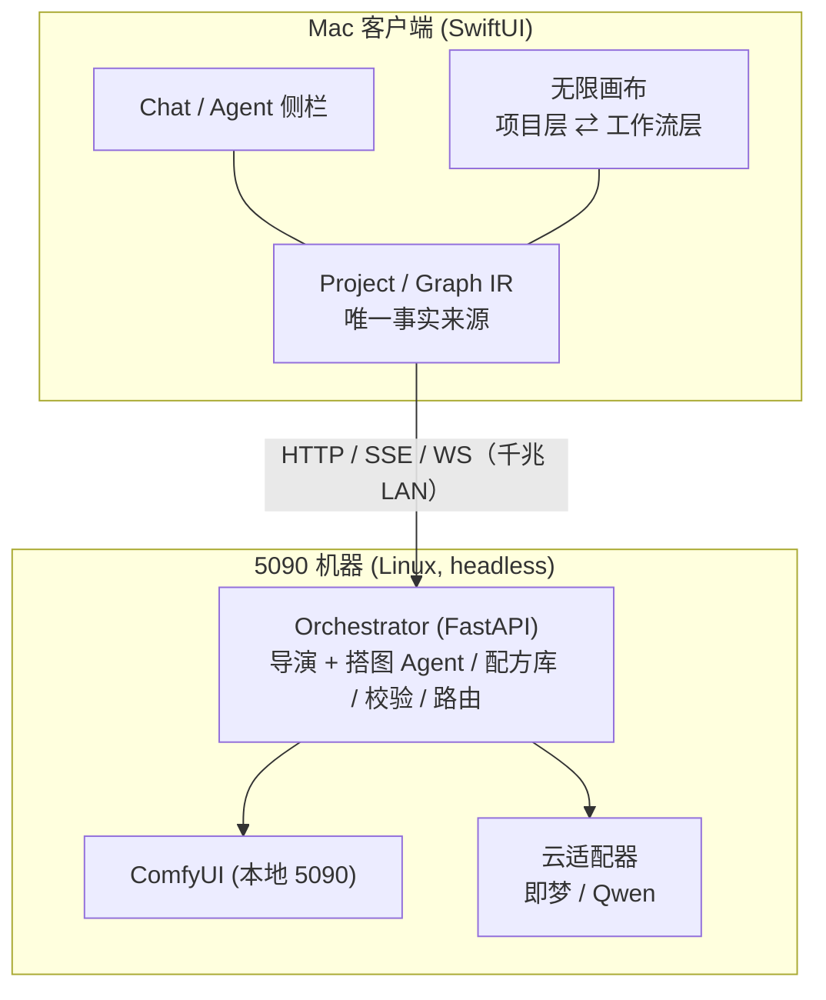
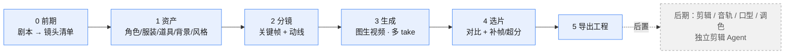
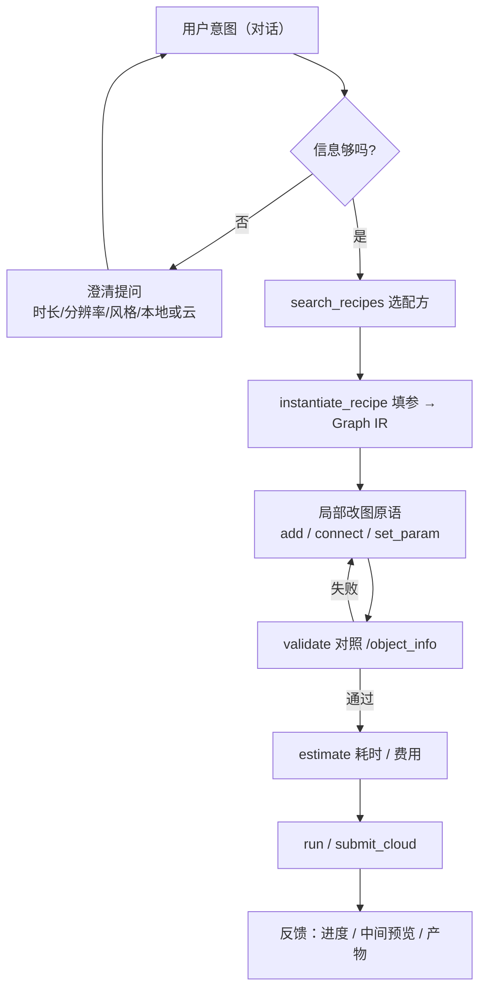
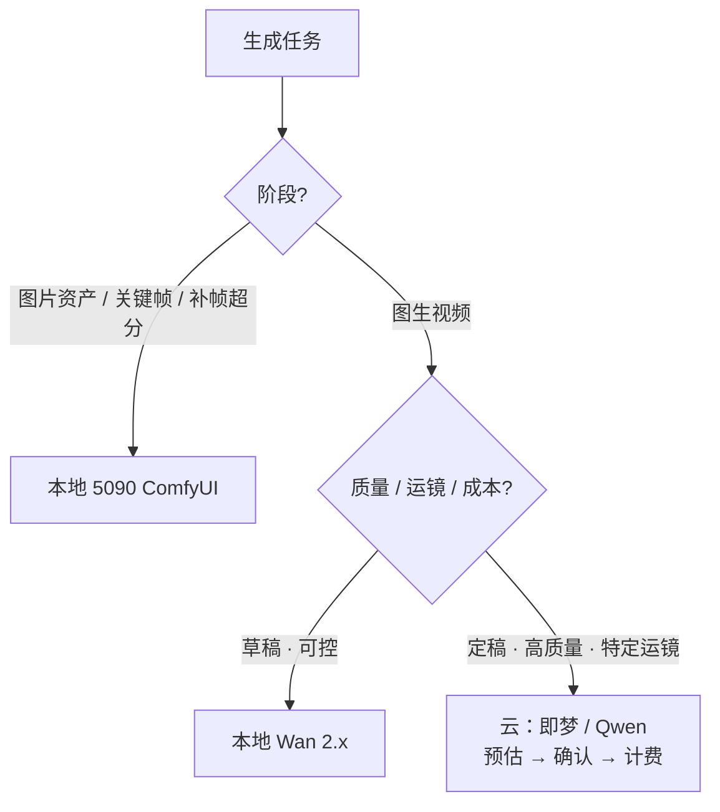
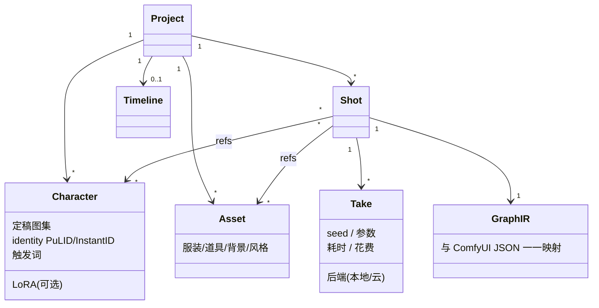
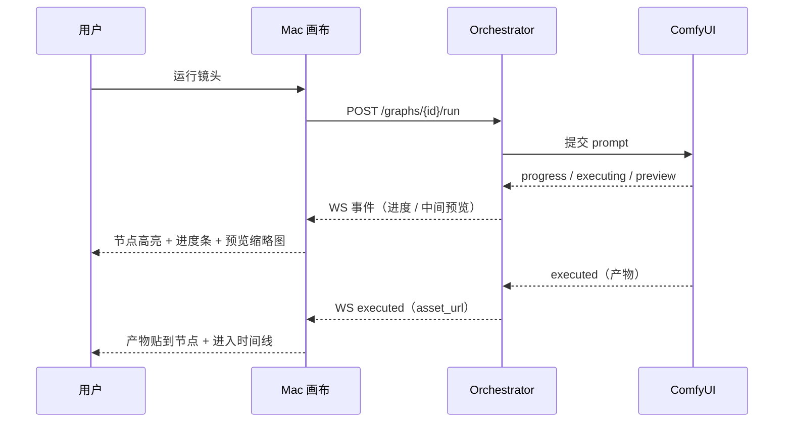
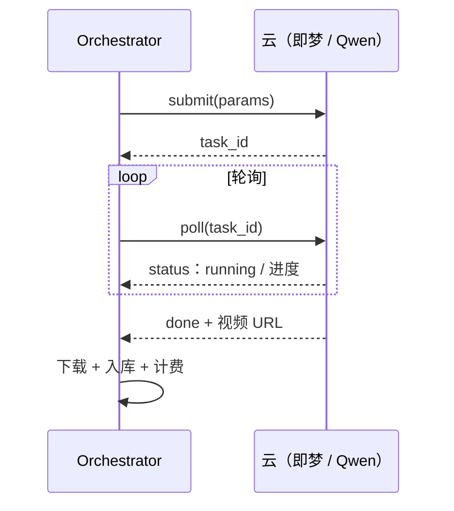
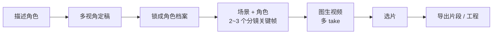

# 流程图

GitHub 原生渲染下方 Mermaid 图。涵盖架构、制作管线、Agent 循环、路由、数据模型、反馈与云作业时序。

## 1. 系统架构（client / server）

## 2. 制作管线（蓝色=MVP，灰色虚线=后置）

## 3. Agent 搭图—校验—执行循环

## 4. 本地 / 云路由决策

## 5. 数据模型

## 6. 反馈事件时序

## 7. 云作业 submit / poll

## 8. MVP 垂直切片（用户旅程）

