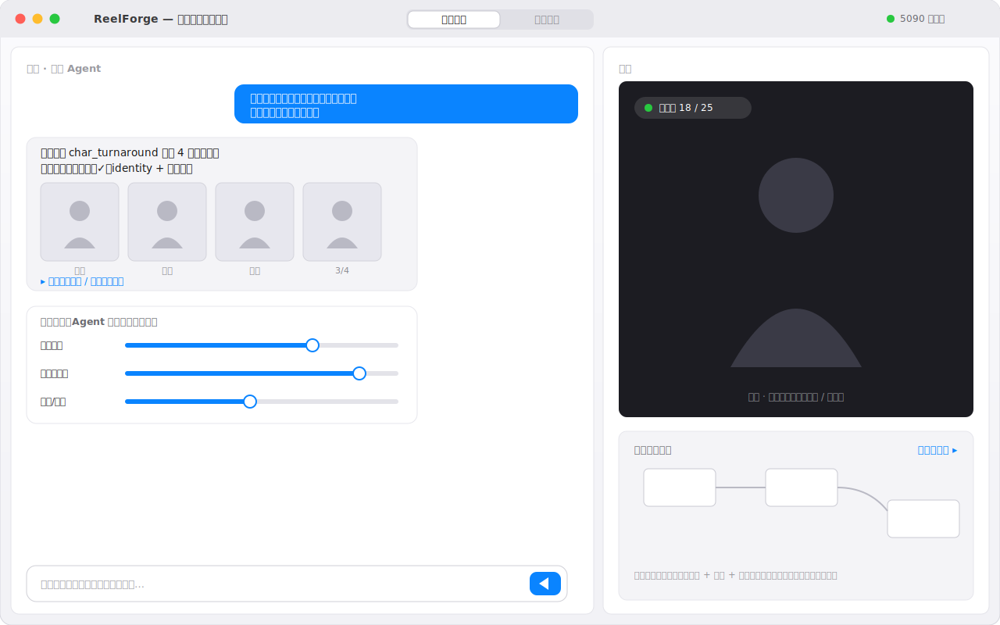
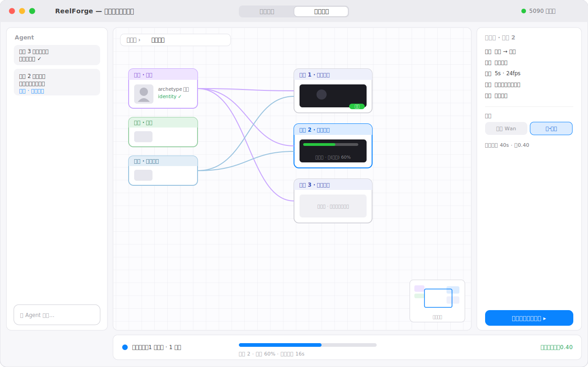
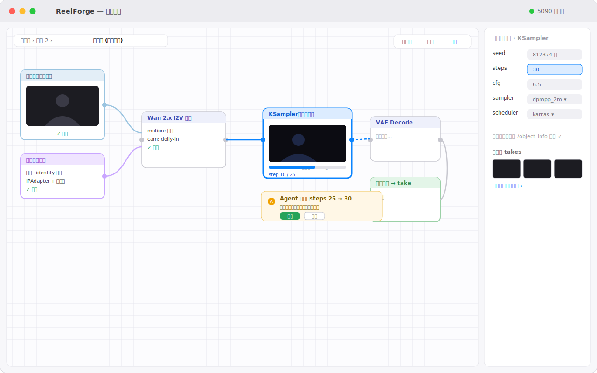
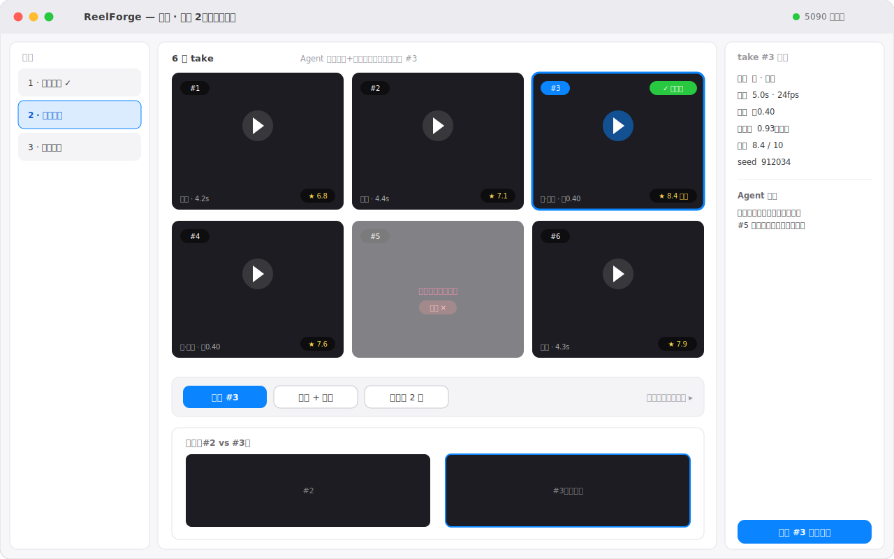
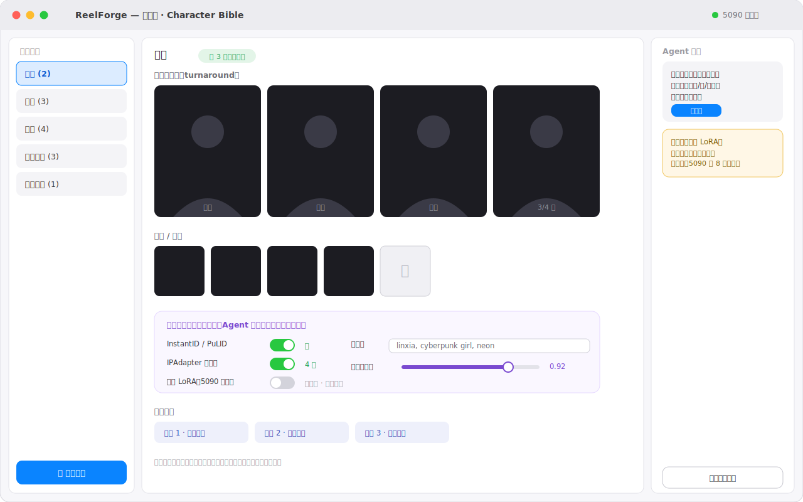

# 关键界面视觉稿（线框 / 视觉草图）

低保真线框稿，用于对齐界面结构与信息架构，不是最终视觉。GitHub 直接渲染下方 SVG。
对应的 UI 核心问题见 [native-ui.md](native-ui.md)，流程图见 [diagrams.md](diagrams.md)。

## 1. 对话优先布局（入门）

默认隐藏节点图：左侧对话 + Agent 反馈（含定稿缩略图、「为什么这么搭」、快速旋钮），右侧大预览 +
折叠的画布缩略，一键展开。

## 2. 画布优先 · 项目层（生产力）

无限画布上节点 = 角色 / 服装 / 背景 / 镜头，连线表达「镜头引用了哪些资产」。顶部面包屑、右下缩略地图、
右侧检查器（含本地/云后端与费用预估）、底部任务队列与累计花费。

## 3. 工作流层（钻进某镜头的 ComfyUI 图）

双击镜头进入节点图：执行中节点高亮 + 进度条 + latent 中间预览；上游节点打勾；Agent 改参以可接受/撤销的
diff 卡片呈现；右侧节点检查器，所有取值对照 `/object_info` 校验。

## 4. 选片对比

一个镜头的多条 take 网格，带美学评分与一致性；Agent 自动初筛并推荐、剔除漂移项；支持两两对比、
选用、补帧超分、再生成。

## 5. 资产库 · Character Bible

角色多视角定稿 + 表情姿态 + **身份锁定卡**（InstantID/PuLID、IPAdapter 参考图、可选专属 LoRA、触发词、
相似度阈值）——一致性的核心载体；下方显示被哪些镜头引用，改动后可一键重生成受影响镜头。

